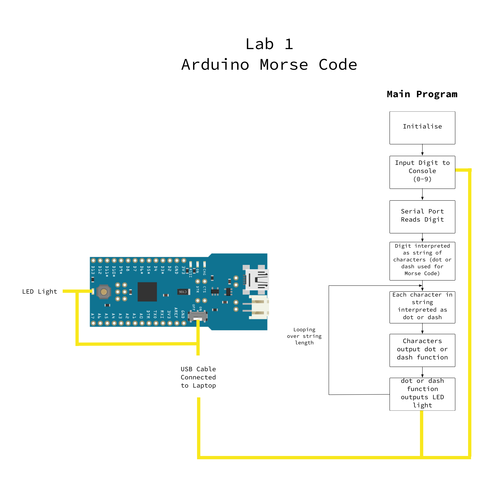

# Lab 1

> Jaldeep Archaya
>
> Frances Coronel
>
> Avash Rao

## Objective

The objective of this lab is to build a Morse code transmitter. It must take a single digit (0-9) as argument from the serial port and blink out that number in Morse code using an LED.

## Executive summary

We connected the USB cable to the `Arduino Fio` and set up the `IDE` so we can could compile and run our `.ino` code to the Arduino.

That context was used to allow the Arduino to read the digit that the console was given as input and output the number using the `LED` light on the Arduino.

## System-Level Block Diagram

## Software Description

Each digit in Morse Code is represented with a series of dots and dashes.

For example, the digit `3` in Morse Code is represented by 3 dots and 2 dashes: `...--`.

The 0-9 digits were stored in a `String` type array with actual `.` and `-` representing the dots and dashes, respectively, as shown in the example above.

Functions were created to represent how long the `LED` light would blink for both the `dot` and `dash` functions.

Based on what digit is input into the console, the dot and dash functions were called a certain number of times.

In turn, these dot and dash functions turned on and delayed the `LED` light on the Arduino Fio by certain time spans.

## References

- [Wikipedia - Morse Code - Chart of the Morse code letters and numbers](https://www.wikiwand.com/en/Morse_code)
    * We used this to see how the 0-9 digits are translated via dots and dashes to put into our array.
- [Arduino - Reference Sheet](https://www.arduino.cc/en/Reference/HomePage)
    * Used the reference sheet to learn language syntax specific to Arduino. For example the function `splitstring`
- Arduino - Built-in examples
    * Used the built-in examples in the Arduino software to learn how to initialize the serial port, read from serial port, initialize the LED-light and make the LED-light blink.