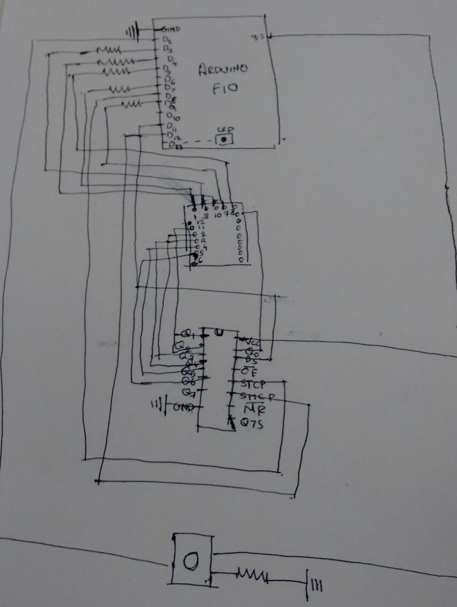
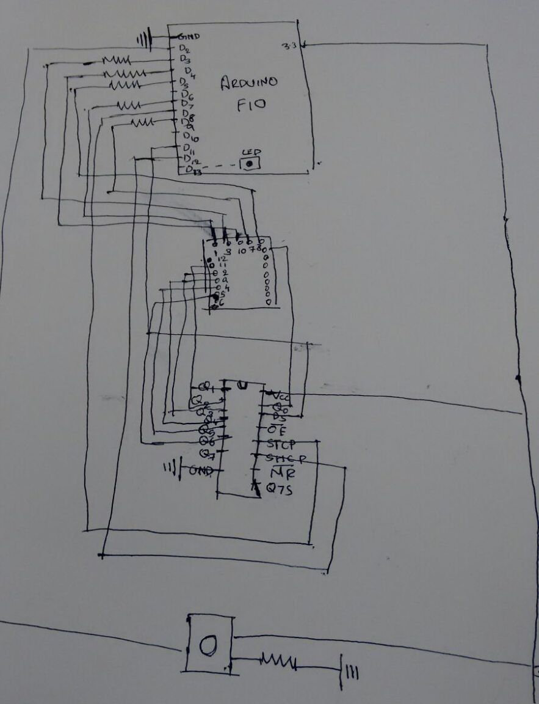
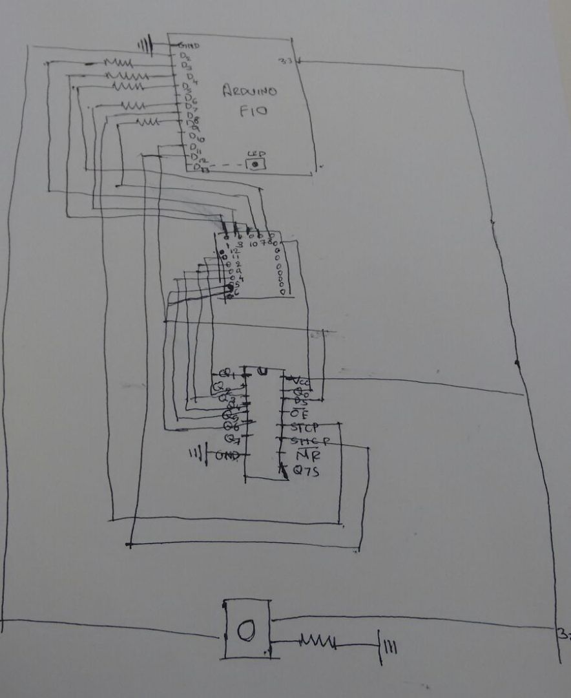

# Lab 2

> Frances Coronel
>
> Sindhu Ravindra

## Objective

The objective of this lab is to build a Morse code receiver/decoder. It must accept Morse code (digits 0-9) as input via user button presses, and output the result to a dot matrix display.

## Executive Summary

We connected the USB cable to the `Arduino Fio` and set up the `IDE` so we can could compile and run our `.ino` code to the Arduino.

That code was used to allow the Arduino to read user input from button pushes, translate the button input to a number and output that number to the `LED` dot matrix display.

## Picture


## Video

Please see `demo.mp4`.

## Code

Please look under the folder called `morse-intrepreter`.

## System-Level Block Diagram





## Software Description

Each digit in Morse Code is represented with a series of dots and dashes.

For example, the digit `3` in Morse Code is represented by 3 dots and 2 dashes: `...--`.

Now based on the changes in voltage that the button transmits when pushed, a dot or dash will be transmitted to the Arduino and relates to a specific digit.

Dots have a voltage signal of <300 ms while dashes have a voltage signal of ≥ 300 ms.

If there is no digit associated with the voltage signals from the button, then the entry will be not be considered valid.

Based on which number has been translated, the `LED` lights on the dot matrix display will turn on/off.

The Arduino, however, does not have enough pins to run the display.

So our team had to use a serial in, parallel out (SIPO) shift register.

Shift register uses one arduino pin to send a series of signals to the register (serial in), which will store those signals and then output all at once (parallel out) on a set of output pins.

Ergo, the board outputs directly to the 5 columns of the matrix and the output for the 7 rows is handled by the shift register.

### Debouncing Algorithm

Debouncing allows the button to avoid noise signal errors when the user is inputting Morse code through button pushing (dots or dashes).

The algorithm is constantly pulling voltage data from the push button and is storing that value in a variable.

Upon storing that new value each time, the algorithm starts a chronometer and checks to see if the voltage didn't change within a certain time period (50 ms). If it didn't, then that value is officially read as the current button state.

Ergo, the algorithm creates a small delay in time to ensure that the user input is not riddled with erroneous noise.

### User Inputs

```
1   .----
2   ..---
3   ...--
4   ....-
5   .....
6   -....
7   --...
8   ---..
9   ----.
0   -----
```


In Morse code, the following is true for the numbers `0-9`:

- for numbers between 1 and 5, the code begins with a dot
- for every other number, the code begins with a dash

Using this context, we can break down what the number will be by checking the first button push of user input.

If first signal is dot, number will be between 1-5 but if it is a dash, number will be 6-9 or 0.

So if the first button push is a dot, we can set the number to 1 until we get input for another dot again. At that point, we continually increment and set the max to 5. Once we get a dash, we can flag it and just stop the increment. So two dots will result in the number 2.

The same applies for dashes except we also account for 0 since 0 is all dashes.

For wrong input, we return `-1` which means the signal changed more than once between dots and dashes (which isn't possible in Morse code).

## References

- [Row-columm Scanning to control an 8x8 LED Matrix](https://www.arduino.cc/en/Tutorial/RowColumnScanning)
- [Serial to Parallel Shifting-Out with a 74HC595](https://www.arduino.cc/en/Tutorial/ShiftOut)